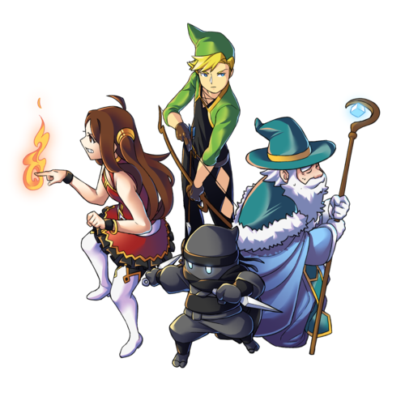

<p align="center">
  
</p>

Treasure Hunters is a local multiplayer game using Phaser 3 and socket.io, developed
for learning purposes for a university subject.

<p align="center">
  
</p>


# Introduction

This a 2D adventure/strategy/puzzle local multiplayer game. It can be played by 1-3
players. The main goal is cooperation among the players, using the different
characters to obtain the treasure.

# Game Elements

## Characters


#### The Archer

🏹 Well, he shoots arrows.


#### The Fire Girl

🔥 She can shoot fireballs and burn things!


#### The Ninja

🐱‍👤 He is very fast and can fit into very small places, but can't shoot anything.


#### The Ice Wizard

❄ He can shoot iceballs and freeze things (and enemies)! But he is old and moves slowly.

Each player can control one character at a time, and can switch between the ones
that are not taken. All characters must be used to complete the puzzles and find
the treasure!

## Controls

|        Key         |       Action        |
| ------------------ | ------------------- |
| Arrow Keys or WASD | Moves character     |
| Spacebar           | Shoots, if possible |
| X                  | Interaction         |
| Tab                | Character Switch    |

## Screenshots

Puzzle spoilers ahead :P

<p align="center">
  
</p>

<p align="center">
  
</p>

--------------------------------

# Building and running

This project uses `yarn` as its dependency manager, so first run

```
yarn
```

to download dependencies.

The run

```
yarn build-dev
```

to build the development server (the production server wasn't implemented)

and then

```
yarn start
```

to start the server.

After that, you and others on the same network can go to `http://<your-local-ip>:8000` to join the game (press spacebar once the first screen shows up)

# Issues

This game was created for a subject and learning purposes, so it's far from
complete, many things don't work as intended, but we hope it can still help
anyone working with Phaser 3 out there.

# Credits

2D Character Design: [@TheFarElo](https://twitter.com/thefarelo), thank you very much!

16 bit assets and audios:

* https://0x72.itch.io/dungeontileset-ii
* https://www.kenney.nl/assets/ui-audio
* https://0x72.itch.io/16x16-dungeon-tileset
* https://therussel.itch.io/sir-ari-assets-16-bit-rpg-assets
* https://pixel-poem.itch.io/dungeon-assetpuck

We also used
[Tiled](https://www.mapeditor.org/),
[TexturePacker](https://www.codeandweb.com/texturepacker) and
[SpriteIlluminator](https://www.codeandweb.com/spriteilluminator)
(in their free/trial versions) to edit the sprites and the map, so thanks
for them as well!
